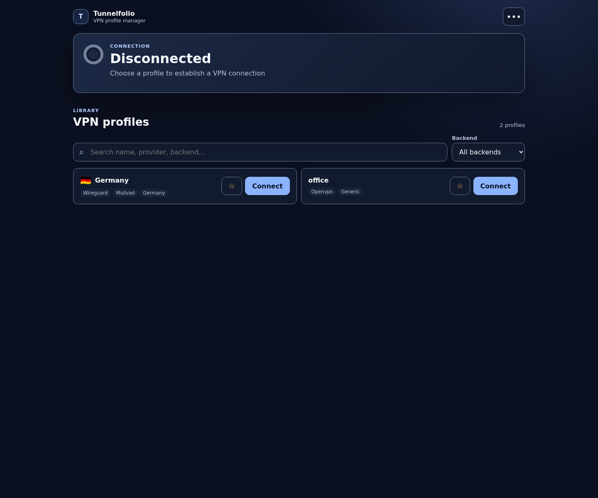

# Tunnelfolio

[](https://github.com/Dhi13man/tunnelfolio/actions/workflows/ci.yml)
[](https://github.com/Dhi13man/tunnelfolio/actions/workflows/codeql.yml)
[](https://scorecard.dev/viewer/?uri=github.com/Dhi13man/tunnelfolio)
[](LICENSE)

Tunnelfolio is a self-hosted web manager for trusted OpenVPN and WireGuard profiles on headless Linux gateways.

Use one mobile-friendly interface to inventory, connect, switch, disconnect, and monitor profiles from Mullvad or other providers. Protocol backends and provider metadata are separate: Mullvad is supported as a provider convention, while generic profiles remain fully operable.

> [!WARNING]
> Tunnelfolio runs with root network authority. OpenVPN and `wg-quick` profiles can execute hooks, scripts, or plugins, so every installed profile is root-equivalent trusted policy. Review profile provenance, keep the application on loopback, and place an authenticated HTTPS reverse proxy in front of mutable deployments.

## Features

- OpenVPN and WireGuard profiles in one backend-neutral catalog and web UI.
- Protocol/provider-qualified IDs that avoid filename collisions.
- Transactional same- and cross-protocol switching with restoration after failure.
- Positive WireGuard interface and OpenVPN process-group readiness/cleanup checks.
- Optional Mullvad country metadata with generic provider fallback.
- Favorites, recents, connection state, WireGuard transfer totals, and read-only inventory mode.
- Loopback-only HTTP, authenticated proxy assertions, strict root-owned files, bounded requests, and atomic private state.

Tunnelfolio is not a VPN server, subscription service, profile downloader, account/key generator, kill switch, multi-host controller, or dynamic plugin platform. Switching can briefly expose traffic between stopping one full-tunnel profile and starting another; v0.1 does not claim leak-free switching.



## Requirements

- Linux with systemd.
- Go 1.27 to build from source, or a supported release archive.
- `openvpn` for OpenVPN profiles.
- `wg` and `wg-quick` for WireGuard profiles.
- Root-owned profile directories with mode `0700` and profile/secret files with mode `0600`.
- An authenticated same-host HTTPS reverse proxy for connect, switch, disconnect, or preference changes.

Only the toolchain for a backend you use is required. A missing backend remains visible as unavailable instead of preventing the other backend from running.

## Installation

Clone and build:

```bash
git clone https://github.com/Dhi13man/tunnelfolio.git
cd tunnelfolio
go build -trimpath -o tunnelfolio .
./tunnelfolio --version
```

Install the binary, service, private directories, and proxy token:

```bash
sudo ./install.sh install
```

The installer creates this profile layout:

```text
/etc/tunnelfolio/profiles/
├── openvpn/
│   └── generic/
└── wireguard/
    └── generic/
```

Create a lowercase provider directory, then copy trusted profiles with private modes:

```bash
sudo install -d -o root -g root -m 0700 /etc/tunnelfolio/profiles/wireguard/mullvad
sudo install -o root -g root -m 0600 mullvad_de.conf /etc/tunnelfolio/profiles/wireguard/mullvad/
sudo install -o root -g root -m 0600 office.ovpn /etc/tunnelfolio/profiles/openvpn/generic/
sudo systemctl restart tunnelfolio
```

Expected service check:

```bash
systemctl is-active tunnelfolio
```

```text
active
```

Never commit, paste into issues, or expose profile contents. WireGuard profiles commonly contain private keys; OpenVPN profiles may contain or reference credentials and private keys.

## Safe remote access

The bundled unit listens on `127.0.0.1:50001` and requires proxy authentication. Configure an HTTPS reverse proxy on the same host. This nginx example uses HTTP Basic authentication and overwrites every trusted header:

```nginx
location / {
    auth_basic "Tunnelfolio";
    auth_basic_user_file /etc/nginx/tunnelfolio.htpasswd;

    proxy_pass http://127.0.0.1:50001;
    proxy_set_header X-Forwarded-Proto https;
    proxy_set_header X-Forwarded-Host $host;
    proxy_set_header X-Remote-User $remote_user;
    proxy_set_header X-Tunnelfolio-Proxy-Token <PROXY_TOKEN>;
}
```

Replace `<PROXY_TOKEN>` with the generated value from `/etc/tunnelfolio/proxy-token` in a root-only nginx configuration. Strip any client-supplied versions of these headers before setting them. Apply proxy connection, rate, and body-size limits, use a valid TLS certificate, and restrict access to a private network or overlay where possible.

Verify through the proxy:

```bash
curl --fail --user '<USER>:<PASSWORD>' https://vpn.example.test/healthz
```

The JSON response reports `"live":true`, readiness, read-only state, and availability for both backends.

## Configuration

| Option | Default | Description |
| --- | --- | --- |
| `--listen` | `127.0.0.1:50001` | Loopback HTTP address |
| `--profiles-dir` | `/etc/tunnelfolio/profiles` | Root-owned protocol/provider catalog |
| `--state-dir` | `/var/lib/tunnelfolio` | Private mutable state directory |
| `--trusted-proxy` | Off | Require authenticated HTTPS proxy assertions |
| `--proxy-token-file` | None | Root-owned shared proxy credential; required with trusted proxy mode |
| `--read-only` | Off | Disable every state-changing endpoint |
| `--version` | Off | Print version/build identity and exit |

Mutable startup fails unless trusted proxy mode and a token file are configured. Unauthenticated loopback operation is available only with `--read-only`; loopback transport is not an authentication boundary.

Profile IDs follow `<backend>/<provider>/<identifier>`, such as `wireguard/mullvad/mullvad_de` or `openvpn/generic/office`. WireGuard identifiers must be valid interface names of at most 15 characters. OpenVPN profiles may use `.ovpn` or `.conf`; WireGuard profiles use `.conf`.

OpenVPN profiles must be non-interactive. Included configs, daemonization, management interfaces, PID files, and unsupported credential-file directives are rejected because they break supervision or confinement. Supported secret-file directives must resolve beneath the profile's provider directory. See [SECURITY.md](SECURITY.md) before installing third-party profiles.

## Operations

The [operations runbook](docs/operations.md) covers health checks, upgrades,
diagnosis, and rollback. Existing installations should follow the
[migration guide](docs/migration.md); release downloads should be checked with
the [release verification guide](docs/release-verification.md).

Check status and logs:

```bash
systemctl status tunnelfolio
journalctl -u tunnelfolio -f
```

Upgrade by verifying a release archive and attestation, replacing the binary and matching unit, then running `sudo ./install.sh install`. The installer preserves `/etc/tunnelfolio` and `/var/lib/tunnelfolio`.

Rollback requires an authenticated disconnect and an absence proof before restoring the previous manager:

```bash
sudo systemctl stop tunnelfolio
sudo ./install.sh check-disconnected
# Restore the verified backup only after the check passes.
sudo systemctl daemon-reload
sudo systemctl restart tunnelfolio
```

Uninstall the binary and unit while preserving profiles, proxy token, preferences, and state. Disconnect through the authenticated UI first; the installer refuses to remove artifacts unless the stopped service, its control group, and catalog-owned WireGuard interfaces are proved absent:

```bash
sudo systemctl stop tunnelfolio
sudo ./install.sh check-disconnected
sudo ./install.sh uninstall
```

Delete `/etc/tunnelfolio` and `/var/lib/tunnelfolio` separately only after backing up material you intend to retain.

## Development

```bash
gofmt -w .
go vet ./...
go test -shuffle=on ./...
go test -race ./...
go build ./...
node --check templates/app.js
node --check tests/ui-browser.cjs
./scripts/check-licenses.sh
```

Most tests use controlled command/process fakes and do not change host networking. CI also runs real OpenVPN and WireGuard transitions, routing, DNS, restoration, and cleanup inside a disposable Linux network namespace. The systemd sandbox and exact target-host environment still require pre-cutover validation. See [CONTRIBUTING.md](CONTRIBUTING.md).
CI also runs the browser behavior suite with pinned `playwright-core` and the
runner's Chrome installation.

## Security

Anyone authorized to mutate Tunnelfolio can change the host's network path with root authority. The trust boundary includes the host, profile and referenced files, reverse proxy, proxy authentication, local token, tool binaries, dependencies, and the private network in front of it. The UI does not make an unsafe deployment safe.

Report vulnerabilities through GitHub private vulnerability reporting as described in [SECURITY.md](SECURITY.md).

## License

Tunnelfolio is available under the [MIT License](LICENSE).
